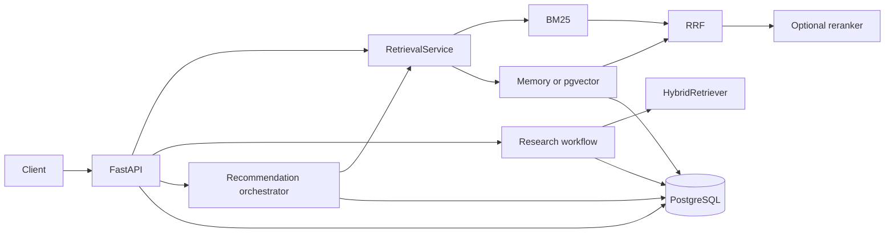

# MarketLens

MarketLens is an offline-first product research API that combines BM25, vector
search, reciprocal rank fusion, structured filtering, and evidence-validated
agent workflows over PostgreSQL/pgvector.

[](https://github.com/yuanmuze/MarketLens-Research-Agent/actions/workflows/ci.yml)


[](LICENSE)

## Capabilities

- BM25 keyword retrieval, 384-dimensional semantic search, and weighted RRF.
- In-memory and PostgreSQL/pgvector semantic backends with ranking-parity tests.
- Optional pinned cross-encoder reranking for quality-oriented requests.
- Price, brand, rating, and category constraints enforced outside generated text.
- Synchronous and asynchronous research workflows with persisted reports.
- Bounded recommendation orchestration with typed tools and evidence checks.
- Deterministic offline provider enabled by default; external LLM calls are opt-in.
- Health, readiness, structured error, request-ID, and feedback APIs.

## Architecture



The research workflow builds longer evidence-backed reports. The recommendation
orchestrator runs a bounded tool loop for concise product suggestions. Both use
the same catalog and retrieval primitives but expose different response contracts.

## Quickstart

Install Python 3.12 and uv, then clone and start the bundled offline fixture:

```bash
git clone https://github.com/yuanmuze/MarketLens-Research-Agent.git
cd MarketLens-Research-Agent
uv sync --locked --group dev
MARKETLENS_USE_FAKE_EMBEDDINGS=true uv run uvicorn marketlens.api.main:app --reload
```

PowerShell equivalent for the final command:

```powershell
$env:MARKETLENS_USE_FAKE_EMBEDDINGS = "true"
uv run uvicorn marketlens.api.main:app --reload
```

The deterministic LLM and embedding providers make this path fully local. Open
`http://127.0.0.1:8000/docs` for the generated OpenAPI interface.

Run a search against the bundled fixture:

```bash
curl "http://127.0.0.1:8000/search?q=wireless%20headphones&top_k=2" \
  -H "X-Request-ID: demo-001"
```

The response follows the current `SearchResponse` schema (`duration_ms` varies):

```json
{
  "request_id": "demo-001",
  "query": "wireless headphones",
  "results": [
    {
      "rank": 1,
      "product_id": "B012",
      "title": "Sennheiser Momentum 4 Wireless Headphones",
      "brand": "Sennheiser",
      "price": 349.95,
      "rating": 4.5,
      "review_count": 6543,
      "score": 0.0315,
      "source": "hybrid"
    },
    {
      "rank": 2,
      "product_id": "B015",
      "title": "Sony WH-CH720N Wireless Noise Cancelling Headphones",
      "brand": "Sony",
      "price": 149.99,
      "rating": 4.4,
      "review_count": 7654,
      "score": 0.0313,
      "source": "hybrid"
    }
  ],
  "total_results": 2,
  "duration_ms": 0.0
}
```

For PostgreSQL/pgvector, start `docker compose up -d db`, apply migrations,
import a catalog, and build its embedding index before starting the API. See
[development.md](docs/development.md) for the complete commands and safety rules.

## API

| Method | Path | Purpose |
|---|---|---|
| GET | `/health` | Application and retrieval summary |
| GET | `/health/live` | Process liveness |
| GET | `/health/ready` | Catalog and semantic-backend readiness |
| GET | `/search` | Filtered BM25, hybrid, or reranked search |
| POST | `/research` | Run a research workflow synchronously |
| POST | `/research/jobs` | Submit an asynchronous research job |
| GET | `/research/jobs/{job_id}` | Read job status |
| GET | `/research/jobs/{job_id}/report` | Read a completed report |
| POST | `/agent/recommend` | Run the bounded recommendation workflow |
| POST | `/feedback` | Attach feedback to a persisted agent run |

FastAPI generates the authoritative request and response schemas at `/openapi.json`.

## Evaluation

Frozen WANDS and ESCI subset evidence compares popularity, BM25, semantic,
hybrid, and reranked retrieval. Memory and pgvector produced identical semantic
and hybrid rankings on 96/96 WANDS and 100/100 ESCI queries. On the fixed ESCI
test subset, quality pgvector measured nDCG@10 `0.71306`; on WANDS it measured
`0.72505`.

The local Docker benchmark recorded 800/800 valid responses and zero external
LLM calls. CPU reranking was the throughput bottleneck. These measurements use
fixed subsets and local hardware; they are neither full-dataset leaderboard
results nor production service-level guarantees. Exact metrics, data provenance,
model revisions, query splits, limitations, and reproduction rules are in
[evaluation.md](docs/evaluation.md) and `benchmarks/`.

## Project structure

```text
src/marketlens/      supported application package
tests/               automated application and PostgreSQL tests
scripts/             data, indexing, benchmark, and operational commands
benchmarks/          frozen manifests and local-load evidence
alembic/             database migrations
docs/                architecture, development, and evaluation
Dockerfile           lockfile-driven API image
compose.yaml         localhost-bound API and pgvector services
```

## Documentation

- [Architecture](docs/architecture.md): components, request paths, and failure boundaries.
- [Development](docs/development.md): setup, configuration, data, testing, and containers.
- [Evaluation](docs/evaluation.md): datasets, metrics, frozen results, and limitations.
- [Contributor instructions](AGENTS.md): repository rules and required quality gates.

## Limitations

- The committed catalog is a small fixture; larger datasets remain local.
- Frozen WANDS and ESCI results use fixed subsets, not complete leaderboard protocols.
- Recorded pgvector rankings used an exact sequential query plan; approximate HNSW
  recall and latency were not measured separately.
- Cross-encoder reranking is CPU-intensive under concurrent load.
- Authentication, distributed execution, autoscaling, and production capacity are
  outside the validated scope.
- The deterministic provider validates orchestration and evidence handling, not the
  answer quality or cost of a hosted LLM.

## License and acknowledgements

MarketLens is available under the [MIT License](LICENSE). The repository began
from concepts and code in LangChain's
[Open Deep Research](https://github.com/langchain-ai/open_deep_research); the
current supported package is `marketlens`, and the original attribution remains
in the license history. WANDS is published by Wayfair under MIT, and ESCI is
published by Amazon Science under Apache-2.0.
