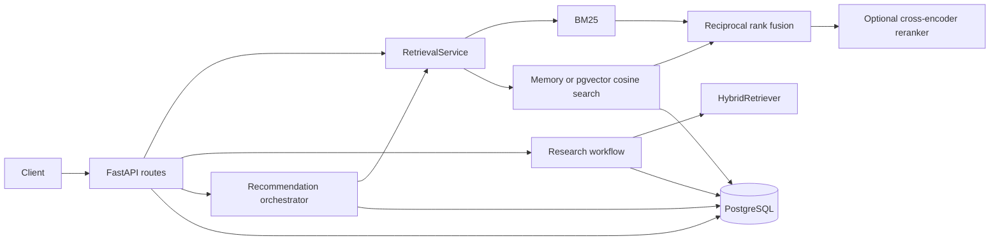

# Architecture

MarketLens is an offline-first FastAPI service for product search and
evidence-backed research. PostgreSQL stores products and request records;
pgvector provides the production semantic-search backend. A JSON catalog and
in-memory vectors remain available for local development and deterministic
tests.

## Runtime components

`marketlens.api.main` owns application startup, validated CORS configuration,
request IDs, and exception responses. `marketlens.api.routes` constructs the
retrieval dependency and exposes health, search, research, recommendation, and
feedback operations. Database sessions commit on successful blocks, roll back
on exceptions, and always close.

## Retrieval path

`RetrievalService` is the stable retrieval boundary. It builds BM25 over the
active catalog and selects either an in-memory embedding index or
`PgVectorEmbeddingRetriever`. Balanced retrieval combines keyword and semantic
rankings with weighted reciprocal rank fusion. Quality mode applies the pinned
cross-encoder after candidate retrieval. Structured price, brand, rating, and
category constraints are enforced independently of generated text.

The pgvector query uses cosine distance with deterministic product-ID tie
breaking. The existing schema defines a 384-dimensional vector column and an
HNSW index; frozen benchmark queries used an exact sequential plan, so those
results do not measure approximate-index behavior.

## Agent boundaries

Two workflows are retained because they serve different API contracts:

- `/research` and `/research/jobs` use `marketlens.agent.graph`, a LangGraph
  workflow that parses a broad request, retrieves products, assesses evidence,
  compares candidates, validates constraints, and builds a research report.
- `/agent/recommend` uses `AgentOrchestrator`, a bounded tool-calling loop for
  concise recommendations. It supports fast, balanced, and quality retrieval,
  verifies cited product fields, limits steps/tool calls, and persists runs.

Both paths are deterministic by default. The research workflow reports web
search as disabled; no web-search SDK is part of the supported runtime. An
OpenAI-compatible provider is optional and isolated behind the `llm` extra.

## Persistence

SQLAlchemy models cover products, research jobs, reports, agent runs, tool
calls, feedback, and product embeddings. Alembic revisions `0001` through
`0004` are frozen. Repository helpers isolate conversion and query logic from
API handlers. PostgreSQL integration fixtures reject database names without
`test` before performing destructive setup.

## Failure behavior

Readiness is unavailable until the selected catalog and semantic backend are
consistent. pgvector mode requires the configured embedding model, dimension,
and complete catalog coverage; it does not silently fall back to memory.
Unexpected API failures return a generic response, while logs and stored job
errors contain stable exception classes rather than raw provider messages.
